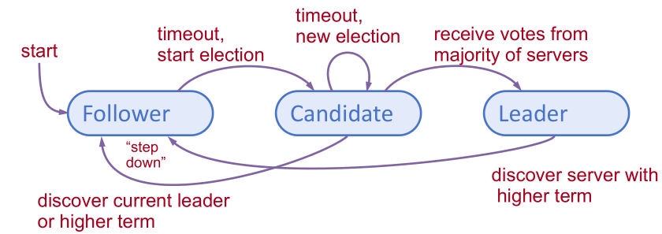
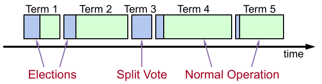
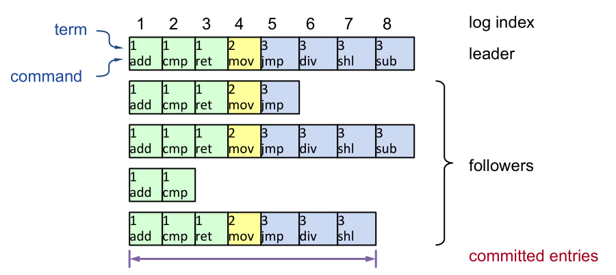
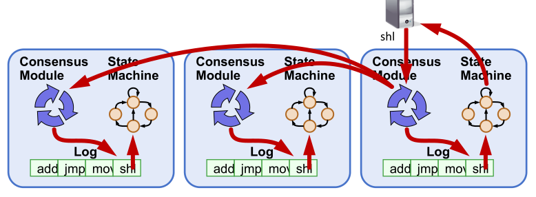
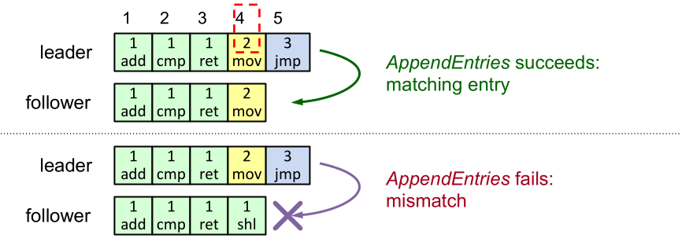
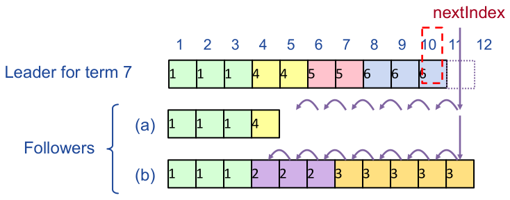
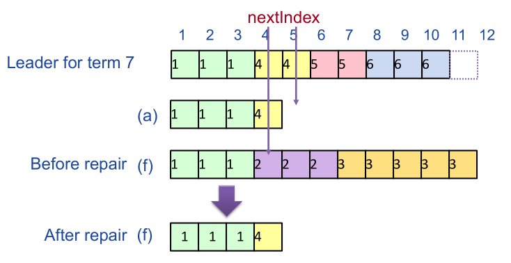

# 分布式系统 课程作业

2020 年 秋季

舒意恒 MF20330067 计算机科学与技术系

## 一. 分析与设计

目标：实现日志副本，所有服务器能够以相同的顺序执行相同的命令，共识模块确保正确的日志副本。

### 1. Raft 简介

#### 1.1 服务器状态

给定任意时间，每个服务器处于三种状态之一：

- Leader：处理所有客户端的交互，与日志副本
- Follower：完全被动
- Candidate：用于候选一个 Leader

通常情况下，1 个 leader 有 (N - 1) 个 Follower.

#### 1.2 活跃验证

- 服务器的初始状态是 Follower，Leaders 通过 AppendEntries RPC 发送心跳（heartbeat）来维持其控制。
- 如果在选举时限（electionTimeout）内没有收到 RPC，follower 认为 leader 已经崩溃并开始新的选举。

#### 1.3 任期（term）

- 时间被划分为任期，每个任期包含选举和正常操作两个阶段。
    - 选举可能失败，或者最终选出一个 Leader
    - 选出一个 Leader 后，各服务器开始正常操作
- 每个服务器维护一个当前任期的值 `currentTerm`
- 任期的关键作用是，识别出过时的信息

#### 1.4 选举

服务器开始选举：自增当前任期 `currentTerm` 值，改变为 Candidate 状态，并为自身投票。

然后，向所有其他服务器发送 RequestVote，重复尝试直到以下条件之一：

1. 受到大多数服务器的投票，成为 Leader，发送 AppendEntries 心跳给所有其他服务器
2. 从有效的 Leader 收到 RPC：重新回到 Follower 状态
3. 没有服务器赢得选举（选举超时），`currentTerm` 增加，开始新的选举

选举的安全性：每个任期只允许最多一个胜选者

- 每个服务器在每个任期中只能投票一次（持久化到磁盘上）
- 同一任期内，两个不同的候选者不能同时获得多数票

选举的有效期：必须有候选者胜出

- 每个候选者在 `[T, 2T]` 范围内随机选择选举时限
- 一个服务器通常在其他服务器开始之前发起并赢得选举
- 一般 `T` 远大于网络 RTT 时能正常工作

#### 1.5 日志结构

日志项描述为 `Log entry = <index, term, command>`.

日志存储磁盘中，即使系统崩溃也能保存。

如果一个日志项被存储到大多数服务器上，则该日志项被视为提交。

- 提交后的日志项持久存储在磁盘中，最终会被状态机执行。

#### 1.6 正常操作

客户端发送命令给 Leader，Leader 将命令存储到日志当中，并通过 AppendEntries RPC 发送给其他 Follower.

一旦一个新的日志项被提交：

- Leader 将命令发送给状态机，并将结果发送给客户端。
- Leader 在随后的 AppendEntries 中携带对 Follower 的心跳信号。
- Follower 将已提交的命令传递给他们的状态机。

如果遭遇崩溃，或者 Follower 响应慢：Leader 重复尝试直到成功。

该方法的性能在通常情况下是最优的，一次成功的 RPC 可以发送给大多数的服务器。

#### 1.7 日志操作：一致性检查

- AppendEntries 在新日志项之前有 `<index, term>` 项。
- Follower 必须包含匹配的项，否则拒绝。
- 实现一个归纳步骤，确保一致性。

#### 1.8 安全要求

一旦将日志项给定一个状态机，其他状态机不得为该日志项给定不同的值。

Raft 的安全属性：如果一个 Leader 决定提交一个日志项，则该日志项将出现在未来所有 Leader 的日志中。

为什么这一点能保证高层的目标：

- Leader 从不会重写他们自己的日志。
- 只有 Leader 日志中的日志项可以被提交。
- 而日志项必须在应用到状态机之前被提交。

#### 1.9 选择最佳的 Leader

一些情况下我们难以分辨哪些日志项已经被提交。

期望的最佳候选者是最有可能包含所有已提交日志的候选者。

- 在 RequestVote 中，候选者包括最后一个日志项的 `index + term`.
- 投票者如果包含更完整的日志，可以拒绝投票：有更新的 term，或者在同一 term 中有更高编号的日志项
- Leader 会有相对于大多数投票者更完整的日志。

#### 1.10 修复 Follower 的日志

新的 Leader 必须使 Follower 的日志与其日志保持一致：删除不相关的日志项，并补充缺失的日志项。

Leader 为每一个 Follower 维护一个 `nextIndex`.

- 下一个日志项的索引发送给 Follower
- 初始化为 (1 + leader 的最后一个索引)

如果 AppendEntries 的一致性检查失败，nextIndex 自减，并重试。

#### 1.11 原 Leader 的离任

Leader 如果临时断连，其他服务器选举新的 Leader，如果原 Leader 重新连接，原 Leader 重新尝试提交日志项。

任期可用于区分过期的 Leader 和候选者：

- 每个 RPC 都包含发送者所处的任期
- 如果发送者的任期小于接受者的任期： 接受者拒绝 RPC
- 如果接受者的任期小于发送者的任期： 接受者改变为 Follower，更新任期，再处理 RPC

选举需要更新多数服务器的任期： 被废置的服务器不能提交新的日志项。

#### 1.12 客户端协议

- 发送命令给 Leader：如果 Leader 是未知的，联系任意服务器，并将客户端重定向到 Leader
- Leader 只在命令被日志记录、提交、执行后响应
- 如果请求时间超时（例如，Leader 崩溃）：
   - 在重定向之后，客户端重新向新 Leader 请求
- 确保只有一个 Leader，即使 Leader 崩溃
   - 例如，Leader 可能执行完指令，但是在响应前崩溃
   - 客户端应该将 ID 嵌入到命令中
   - 客户端 ID 应该包含在日志项中
   - 在接受请求之前，Leader 检查日志项中是否是同一 ID

## 二. 实验内容

### 2.1 实验一

- 修改 `raft.go` 中的 `Make()` 函数以构建一个后台 goroutine，当它一段时间内没有收到来自其他结点的消息时，通过发送 RequestVote RPC 开始一项选举。
    - 实现 `RequestVote` RPC handler，服务器会开始投票
- 为了实现心跳，定义一个结构 `AppendEntries`，并使 leader 周期性地将它发出。
    - 需要实现 `AppendEntires` RPC handler.
- 确保选举超时不会总是同时触发。

### 2.2 实验二

在实验一的基础上，实现 leader 和 follower 的代码，添加新的日志项。

- 实现 `Start()`，完成 `AppendEntries` RPC 结构，发送信息，并完成 `AppendEntry` RPC handler.
- 通过 `TestBasicAgree()` 测试，尝试通过 `Persist` 前所有测试。

### 2.3 实验三（选做）

- 处理 Raft 协议的容错机制。
    - 需要 Raft 在重启后保持一致状态。
- 无需使用磁盘，通过 Persister (见 `Persister.go`) 保存和恢复状态。
    - 通过 Persister 初始化状态，当状态变化时通过它保存持久化状态。
- 确定服务器在 Raft 协议的哪些地方需要持久化其状态，并在这些地方插入对 persist() 的调用。

## 三. 实验演示

## 四. 小结