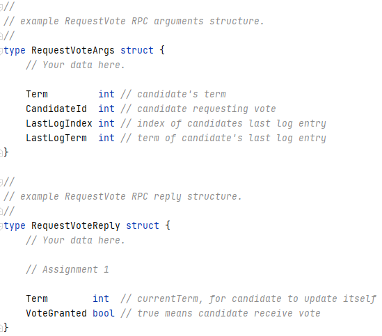
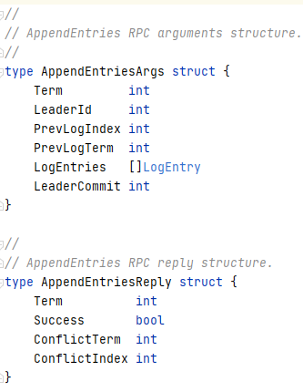

# 分布式系统 课程作业

2020 年 秋季

舒意恒 MF20330067 计算机科学与技术系

[TOC]

## 一. Raft 简介

目标：实现日志复写，所有服务器能够以相同的顺序执行相同的命令，共识模块确保正确的日志复写。

#### 1.1 服务器状态

给定任意时间，每个服务器处于三种状态之一：

- 领袖 Leader：处理所有客户端的交互，与日志复写
- 追随者 Follower：完全被动地执行操作，接受远程过程调用
- 候选者 Candidate：作为一个领袖的候选者

通常情况下，1 个领袖有 (N - 1) 个追随者.

#### 1.2 活跃验证

- 服务器的初始状态是追随者，领袖通过 AppendEntries RPC 发送心跳（heartbeat）来维持其控制。
- 如果在选举时限（electionTimeout）内没有收到 RPC，追随者认为领袖已经宕机并开始新的选举。


#### 1.3 任期（term）


- 时间被划分为任期，每个任期包含选举和正常操作两个阶段。
    - 选举可能失败，或者最终选出一个领袖
    - 选出一个领袖后，各服务器开始正常操作
- 每个服务器维护一个当前任期的值 `currentTerm`
- 任期的关键作用是，识别出过时的信息

#### 1.4 选举

服务器开始选举：自增当前任期 `currentTerm` 值，改变为 Candidate 状态，并为自身投票。

然后，向所有其他服务器发送 RequestVote，重复尝试直到以下条件之一：

1. 受到大多数服务器的投票，成为领袖，发送 AppendEntries 心跳给所有其他服务器
2. 从有效的领袖收到 RPC：重新回到追随者状态
3. 没有服务器赢得选举（选举超时），`currentTerm` 增加，开始新的选举

选举的安全性：每个任期只允许最多一个胜选者

- 每个服务器在每个任期中只能投票一次（持久化到磁盘上）
- 同一任期内，两个不同的候选者不能同时获得多数票


选举的有效期：必须有候选者胜出

- 每个候选者在 `[T, 2T]` 范围内随机选择选举时限
- 一个服务器通常在其他服务器开始之前发起并赢得选举
- 一般 `T` 远大于网络 RTT 时能正常工作

#### 1.5 日志结构


日志项描述为 `Log entry = <index, term, command>`.

日志存储磁盘中，即使系统崩溃也能保存。

如果一个日志项被存储到大多数服务器上，则该日志项被视为提交。

- 提交后的日志项持久存储在磁盘中，最终会被状态机执行。

#### 1.6 正常操作


客户端发送命令给领袖，领袖将命令存储到日志当中，并通过 AppendEntries RPC 发送给其他追随者.

一旦一个新的日志项被提交：

- 领袖将命令发送给状态机，并将结果发送给客户端。
- 领袖在随后的 AppendEntries 中携带对追随者的心跳信号。
- 追随者将已提交的命令传递给他们的状态机。

如果遭遇崩溃，或者追随者响应慢：领袖重复尝试直到成功。

该方法的性能在通常情况下是最优的，一次成功的 RPC 可以发送给大多数的服务器。

#### 1.7 日志操作：一致性检查


- AppendEntries 在新日志项之前有 `<index, term>` 项。
- 追随者必须包含匹配的项，否则拒绝。
- 实现一个归纳步骤，确保一致性。

#### 1.8 安全要求

一旦将日志项给定一个状态机，其他状态机不得为该日志项给定不同的值。

Raft 的安全属性：如果一个领袖决定提交一个日志项，则该日志项将出现在未来所有领袖的日志中。

为什么这一点能保证高层的目标：

- 领袖从不会重写他们自己的日志。
- 只有领袖日志中的日志项可以被提交。
- 而日志项必须在应用到状态机之前被提交。


#### 1.9 选择最佳的领袖

一些情况下我们难以分辨哪些日志项已经被提交。


期望的最佳候选者是最有可能包含所有已提交日志的候选者。

- 在 RequestVote 中，候选者包括最后一个日志项的 `index + term`.
- 投票者如果包含更完整的日志，可以拒绝投票：有更新的 term，或者在同一 term 中有更高编号的日志项
- 领袖会有相对于大多数投票者更完整的日志。

#### 1.10 修复追随者的日志


新的领袖必须使追随者的日志与其日志保持一致：删除不相关的日志项，并补充缺失的日志项。

领袖为每一个追随者维护一个 `nextIndex`.

- 下一个日志项的索引发送给追随者
- 初始化为 (1 + leader 的最后一个索引)

如果 AppendEntries 的一致性检查失败，nextIndex 自减，并重试。


#### 1.11 原领袖的离任

领袖如果临时断连，其他服务器选举新的领袖，如果原领袖重新连接，原领袖重新尝试提交日志项。

任期可用于区分过期的领袖和候选者：

- 每个 RPC 都包含发送者所处的任期
- 如果发送者的任期小于接受者的任期：接受者拒绝 RPC
- 如果接受者的任期小于发送者的任期：接受者改变为追随者，更新任期，再处理 RPC

选举需要更新多数服务器的任期： 被废置的服务器不能提交新的日志项。

#### 1.12 客户端协议

- 发送命令给领袖：如果领袖是未知的，联系任意服务器，并将客户端重定向到领袖
- 领袖只在命令被日志记录、提交、执行后响应
- 如果请求时间超时（例如，领袖崩溃）：
    - 在重定向之后，客户端重新向新领袖请求
- 确保只有一个领袖，即使领袖崩溃
    - 例如，领袖可能执行完指令，但是在响应前崩溃
    - 客户端应该将 ID 嵌入到命令中
    - 客户端 ID 应该包含在日志项中
    - 在接受请求之前，领袖检查日志项中是否是同一 ID

## 二. 实验内容

### 2.1 实验一

- 修改 `raft.go` 中的 `Make()` 函数以构建一个后台 goroutine，当它一段时间内没有收到来自其他结点的消息时，通过发送 RequestVote RPC 开始一项选举。
    - 实现 `RequestVote` RPC handler，服务器会开始投票
- 为了实现心跳，定义一个结构 `AppendEntries`，并使领袖周期性地将它发出。
    - 需要实现 `AppendEntires` RPC handler.
- 确保选举超时不会总是同时触发。

### 2.2 实验二

在实验一的基础上，实现领袖和追随者的代码，添加新的日志项。

- 实现 `Start()`，完成 `AppendEntries` RPC 结构，发送信息，并完成 `AppendEntry` RPC handler.
- 通过 `TestBasicAgree()` 测试，尝试通过 `Persist` 前所有测试。

### 2.3 实验三（可选）

- 处理 Raft 协议的容错机制。
    - 需要 Raft 在重启后保持一致状态。
- 无需使用磁盘，通过 Persister (见 `Persister.go`) 保存和恢复状态。
    - 通过 Persister 初始化状态，当状态变化时通过它保存持久化状态。
- 确定服务器在 Raft 协议的哪些地方需要持久化其状态，并在这些地方插入对 persist() 的调用。

## 三. 算法设计

本项目通过 Golang 进行开发，Golang 是一种支持并发的常用于服务器的编程语言。通过 Golang 实现 Raft 算法是理解该算法的一种有效方式。

### 3.1 服务器启动

`Make` 函数用于给服务或测试函数构建一个 Raft 服务器。所有 Raft 服务器的端口都存储在 `peers[]` 中，本服务器的端口是 `peers[me]`. 所有服务器的 `peers[]` 数组都有相同的顺序。
`Make()` 必须快速返回，并且为任何长期运行的工作启动一个 goroutine.

`Make` 函数声明如下：

```go
func Make(peers []*labrpc.ClientEnd, me int, persister *Persister, applyCh chan ApplyMsg) *Raft
```

### 3.2 添加命令

使用 Raft 的服务期望同意下一条命令的执行，并将命令附加到 Raft 日志中，则调用 `Start` 方法。如果一个服务器不是领袖，则返回 false；否则，尝试开始达成一致，并立即返回。

`Start` 方法声明如下：

```go
func (rf *Raft) Start(command interface{}) (int, int, bool)
```

`Start` 方法的输入是期望执行的命令，三项输出分别是命令被提交后的编号、当前任期、服务器是否自认为是领袖的判断.

### 3.3 竞选与请求投票

请求投票 RPC 的参数和返回值的相关数据结构设计如下：



候选者通过 `rf.startsElection` 方法宣布参加竞选，并向其他服务器拉票。

```go
func (rf *Raft) startsElection()
```

候选者通过远程过程调用，请求其他服务器执行 `rf.RequestVote` 方法。其他服务器在该方法中决定，是否投票给该候选者。

```go
func (rf *Raft) RequestVote(args RequestVoteArgs, reply *RequestVoteReply)
```

服务器同意或拒绝拉票请求，通过如下方法实现。

```go
func (rf *Raft) RejectVote(reply *RequestVoteReply)
func (rf *Raft) GrantVote(args RequestVoteArgs, reply *RequestVoteReply)
```

其中，远程过程调用的通过 `sendRequestVote` 方法发起。

```go
func (rf *Raft) sendRequestVote(server int, args RequestVoteArgs, reply *RequestVoteReply) bool
```

随着时间的推移，以及竞选过程的推进，服务器的角色可能会发生转变。其角色转变是通过以下函数实现的：

```go
func (rf *Raft) changeToFollower(term int, voteFor int)
func (rf *Raft) changeToCandidate()
func (rf *Raft) changeToLeader()
```

### 3.4 添加日志项

添加日志项 RPC 的参数和返回值的相关数据结构设计如下：



领袖通过 `heartBeat` 方法发送心跳，维持日志的一致性。

```
func (rf *Raft) heartBeat()
```

其中，远程过程调用通过 `sendAppendEntries` 方法发起。

```go
func (rf *Raft) sendAppendEntries(server int, args AppendEntriesArgs, reply *AppendEntriesReply) bool {
```

领袖通过远程过程调用，使追随者执行 `AppendEntries` 方法。

```go
func (rf *Raft) AppendEntries(args AppendEntriesArgs, reply *AppendEntriesReply)
```

## 四. 测试方法

测试方法编写在 `src/raft/test_test.go` 文件中，主要进行以下测试。

### 4.1 TestInitialElection

1. 创建包含 3 台服务器的集群
2. 检查领袖是否被正常选举出，检查每个任期是否只有不超过一个领袖
3. 检查在网络正常的情况下，休眠一段时间后，检查任期是否变化

### 4.2 TestReElection

1. 创建包含 3 台服务器的集群
2. 检查领袖是否被正常选举出，检查每个任期是否只有不超过一个领袖，将该领袖称为 leader1
3. 将该 leader1 断开连接，检查是否有新的 leader2 被选举出
4. 重新连接 leader1，并不对 leader2 作干扰
5. 断开两台服务器的连接，这时不会有领袖被选举出来，没有追随者投票
6. 逐一恢复两台服务器的连接，检查是否有新的领袖被选举出来

### 4.3 TestBasicAgree

1. 创建包含 5 台服务器的集群
2. 进行三轮迭代，每轮迭代 `Start` 一个命令，检查命令是否已正确复制到集群中所有服务器上

### 4.4 TestFailAgree

1. 创建包含 3 台服务器的集群
2. `Start` 一个命令，检查命令是否已正确复制到集群中所有服务器上
3. 断开某台服务器的连接，`Start` 若干命令，检查命令是否已正确复制到 2 台已连接的服务器上
4. 重新连接之前断开的服务器，`Start` 若干命令，检查命令是否已正确复制到 3 台已连接的服务器上

### 4.5 TestFailNoAgree

1. 创建包含 5 台服务器的集群
2. `Start` 一个命令，检查命令是否已正确复制到 5 台服务器上
3. 断开其中 3 台服务器的连接，`Start` 一个命令，检查命令是否被复制到已连接的服务器上
4. 重新连接断开服务器的连接， `Start` 一个命令，检查命令是否已正确复制到所有已连接的 5 台服务器上

### 4.6 TestConcurrentStarts

1. 创建包含 3 台服务器的集群
2. 进行五轮迭代，每轮迭代中 `Start` 一个命令，然后并发 `Start` 其他五个命令，检查所有命令是否已正确复制到所有服务器上；检查通过一次即退出迭代

### 4.7 TestRejoin

1. 创建包含 3 台服务器的集群
2. `Start` 一个命令，检查命令是否已正确复制到 3 台服务器上
3. 将第 2 步中的 leader1 断开连接，并在 leader1 中 `Start` 个命令；由于 leader1 已断开，命令是无效的
4. `Start` 一个命令，检查命令是否已正确复制到已连接的 2 台服务器上
5. 将第 4 步中的 leader2 断开连接，并重新连接 leader1
6. `Start`一个命令，检查命令是否已正确复制到已连接的 2 台服务器上
7. 重新连接 leader2 并 `Start` 一个命令，检查命令是否已正确复制到已连接的 3 台服务器上

TestBackup 过程与之类似，但条件更加苛刻。

### 4.8 TestCount

检查选举产生领袖所需的 RPC 数量是否太高。

### 4.9 TestPersist1 / TestPersist2 / TestPersist3

基本过程是测试服务器宕机后，能否恢复到宕机之前的状态。

如果未实现状态的持久化，在宕机恢复后状态为空，`Start` 命令会导致和已提交的日志不一致。

## 五. 实验演示

算法通过 `src/raft/test_test.go` 中的测试函数进行测试，测试效果如下图所示。


测试函数打印的信息具体如下：

```
=== RUN   TestInitialElection
Test: initial election ...
  ... Passed
--- PASS: TestInitialElection (2.51s)
=== RUN   TestReElection
Test: election after network failure ...
  ... Passed
--- PASS: TestReElection (4.51s)
=== RUN   TestBasicAgree
Test: basic agreement ...
  ... Passed
--- PASS: TestBasicAgree (0.47s)
=== RUN   TestFailAgree
Test: agreement despite follower failure ...
  ... Passed
--- PASS: TestFailAgree (5.31s)
=== RUN   TestFailNoAgree
Test: no agreement if too many followers fail ...
  ... Passed
--- PASS: TestFailNoAgree (3.40s)
=== RUN   TestConcurrentStarts
Test: concurrent Start()s ...
  ... Passed
--- PASS: TestConcurrentStarts (0.57s)
=== RUN   TestRejoin
Test: rejoin of partitioned leader ...
  ... Passed
--- PASS: TestRejoin (3.72s)
=== RUN   TestBackup
Test: leader backs up quickly over incorrect follower logs ...
  ... Passed
--- PASS: TestBackup (16.61s)
=== RUN   TestCount
Test: RPC counts aren't too high ...
  ... Passed
--- PASS: TestCount (2.07s)
=== RUN   TestPersist1
Test: basic persistence ...
  ... Passed
--- PASS: TestPersist1 (3.04s)
=== RUN   TestPersist2
Test: more persistence ...
  ... Passed
--- PASS: TestPersist2 (16.91s)
=== RUN   TestPersist3
Test: partitioned leader and one follower crash, leader restarts ...
  ... Passed
--- PASS: TestPersist3 (1.30s)
=== RUN   TestFigure8
Test: Figure 8 ...
  ... Passed
--- PASS: TestFigure8 (27.20s)
=== RUN   TestUnreliableAgree
Test: unreliable agreement ...
  ... Passed
--- PASS: TestUnreliableAgree (2.76s)
=== RUN   TestFigure8Unreliable
Test: Figure 8 (unreliable) ...
  ... Passed
--- PASS: TestFigure8Unreliable (29.57s)
=== RUN   TestReliableChurn
Test: churn ...
  ... Passed
--- PASS: TestReliableChurn (16.51s)
=== RUN   TestUnreliableChurn
Test: unreliable churn ...
  ... Passed
--- PASS: TestUnreliableChurn (16.49s)
PASS
```

## 六. 小结

本项目部分实现了一种分布式系统中的共识算法 Raft。 Raft 替代了 Paxos 算法，其目标在于提供更清晰的逻辑分工，使得算法能够被更好地理解，同时安全性更高。

Raft 算法中解决的最重要的一些问题包括，领袖选举、日志复写、安全性。

### 6.1 领袖选举

当算法开始，或领袖崩溃或断开连接时，该集群需要选举出新的领袖。 此时，集群进入新的任期（term），如果新的领袖被成功选举出则开始这一任期的工作，反之开始下一新的任期进行重新选举。

领袖选举是通过选举的候选者（candidate）发起的，而候选者的产生是任何在其时限内没有收到心跳包（heartbeat）的服务器。即一个任期的追随者如果没有在时限内收到心跳包，就将任期编号自增、向其他所有服务器宣布竞选与拉票、并为自身投一票。

每个服务器在每个任期中仅能投一票，该票投给最早拉票的服务器。

除追随者外，一个候选者也可能收到拉票。如果候选者收到其他候选者的拉票，且任期编号不小于其自身任期编号，则放弃竞选并投票给该候选者，转变为追随者。一个候选者收到过半选票，即当选为新的领袖。如果在时限内没有选出领袖，则该任期自动终止，新的任期及选举开始。

每个服务器的超时时限都是随机的，这降低了服务器同时开始竞选的几率，并降低两候选者获得票数均不过半导致的选举没有产生领袖的几率。

### 6.2 记录复写

记录复写的工作主要由领袖负责。领袖接受来自各服务器的指令，将指令写入自己记录的新指令部分，然后将指令转发给追随者。如果追随者没有响应，领袖将不断重发指令，直到每个追随者都成功将新指令写入记录为止。

当领袖收到过半追随者确认写入的消息，就将指令视为已提交（committed）。当追随者确认指令状态变为已提交，就开始在其状态机上执行指令。

当领袖宕机时，领袖记录的某些新指令可能还没有复写到集群整体中，造成集群记录处于不一致的状态。

新领袖需要重新维护日志的一致性，让追随者的记录与其保持一致。新领袖将于每个追随者比对记录，找出两者一致的最后一项指令，删除追随者之后的指令，将自己之后的指令拷贝给追随者。新领袖与所有追随者比对完成后，每个服务器的记录就重回一致。

### 6.3 安全性

如论文图 3 所示，Raft 的安全性主要体现在：

- 选举安全：每个任期最多只选出一个领袖，不存在多个领袖的状态。
- 指令附加：新指令会附加在记录尾端，不会改写之前的指令或者删除已有指令。
- 记录一致：如果某个指令在两个记录中的任期和指令序号一致，则保证序号较小的指令也完全一致。
- 领袖完整性：某个指令在某个任期中存储成功后，则保证它存在于领袖该任期之后的记录中。
- 状态机安全：如果某服务器在其状态机上执行了某指令，其他服务器保证不会在相同状态上执行不同的指令。